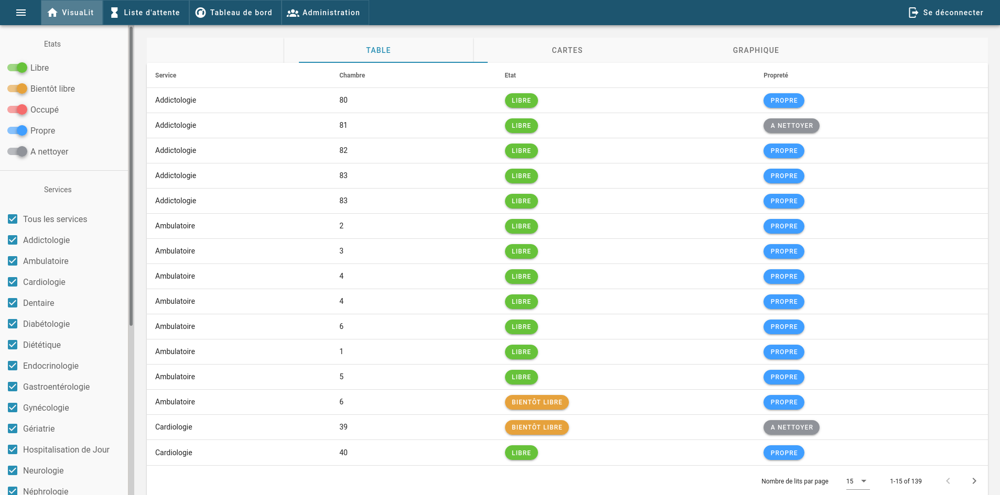
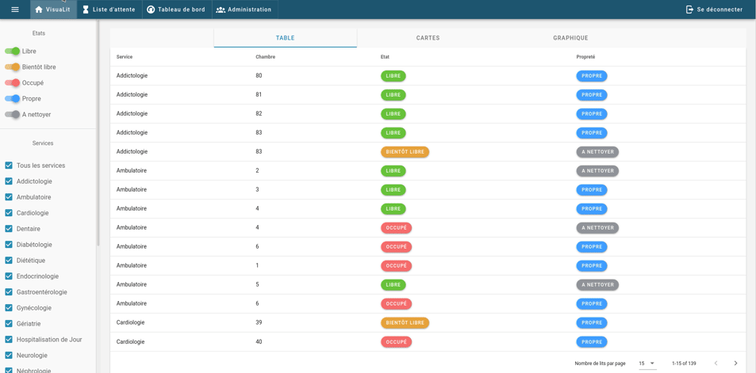
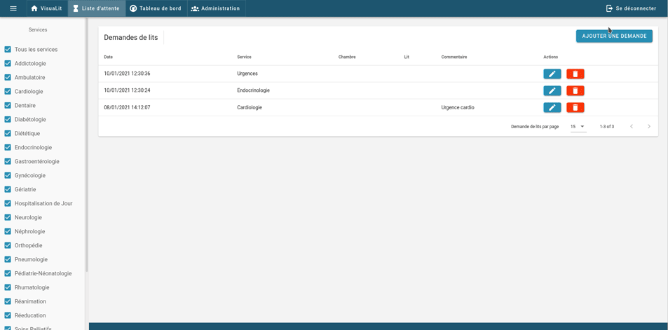
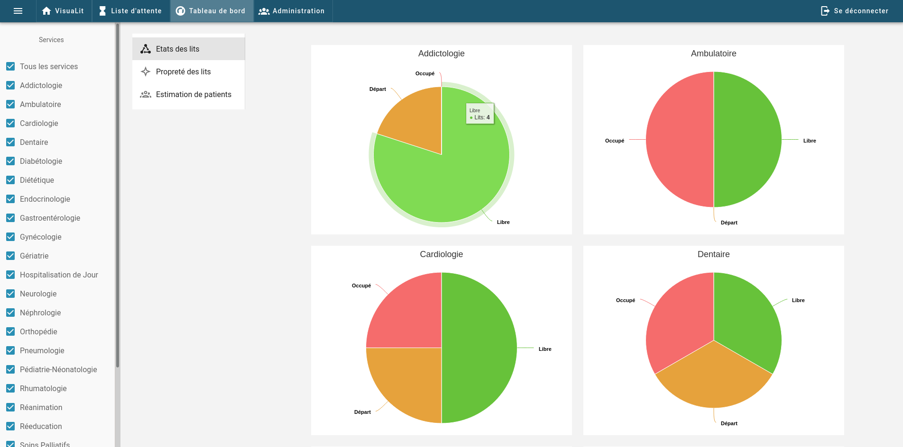
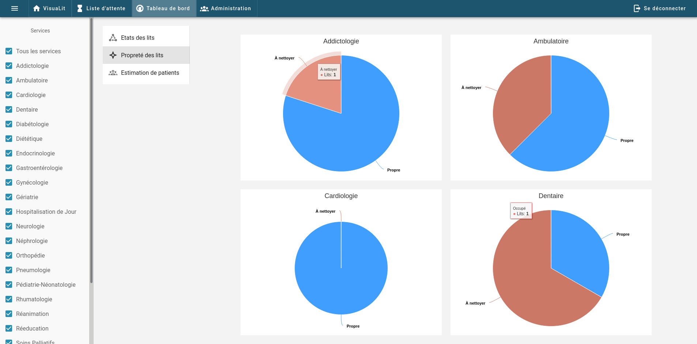
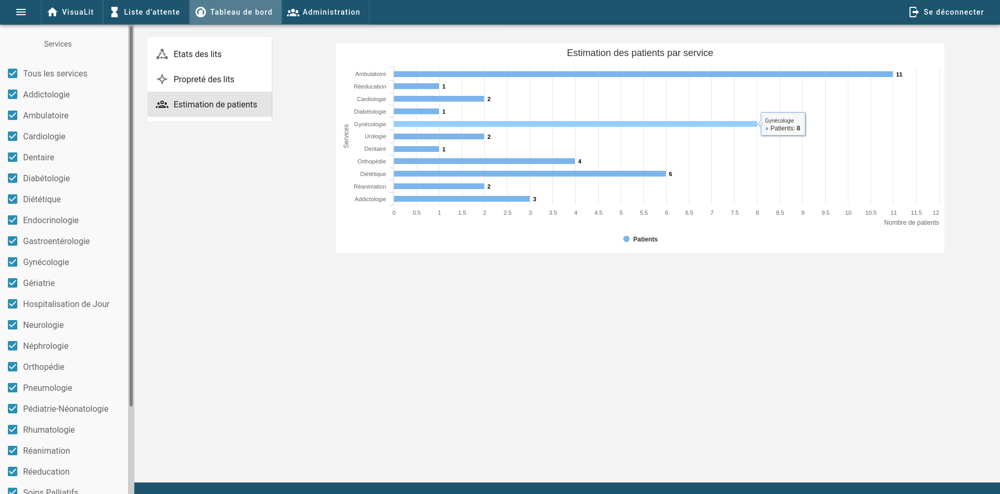
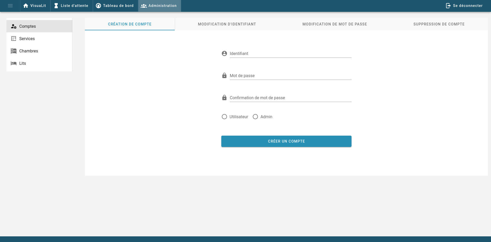

# visualit-front

## Optimize hospital bed occupancy

VisuaLit was my graduation project, it was built with a team of four: one backend developer, one android developer, one IOS developer and me, responsible of the frontend. Before talking about the content of my work let's explain the concept of VisuaLit.

VisuaLit is a hospital bed management system. It allows hospital and maintenance staff, thanks to a web client and two mobile clients (Android and IOS), to update the status of beds in the different departments of a hospital to simplify the organization of the staff's work and its efficiency. Easy to use, it integrates perfectly into the daily life of its users to avoid any additional workload. To change the status of a bed, simply scan the corresponding QR code and choose the new status. This way, the change is immediately recorded and available to all. VisuaLit also includes a queuing system and statistics on the hospital's occupancy rate to highlight all the elements to improve the accommodation capacities of the establishment.

If you understand french language, [here](https://eip.epitech.eu/2021/visualit/) is a link to the showcase site that I build for this project.

Disclaimer, the repository once build cannot work since it will be unable to request the REST api.

## Home page

---

After authentication the user end up on the page below: 
It's the most significant part of the application, this view show all the beds and their states. It can be filter by departments of the hospital and/or by bed's states. Three different representations are available: table, cards and network.

## Waiting list

---

This view gives the possibility to warn the hospital of different bed request (add, update, delete) represented throughout a table:

## Dashboard

---

This view is a dashboard that represent three different graphics concerning the states of the beds, the cleanliness of the beds and an estimation of patients per department.

## Admin page

---

Finally, this view purpose is to manage (add, update and delete) account and the hospital in the hospital (department, room and beds)

### Conclusion

The overall design was thought to be simple, informative straightforward, professional and easy to use for health staff.

This was my first frontend project and by extension my first project with VueJS.
